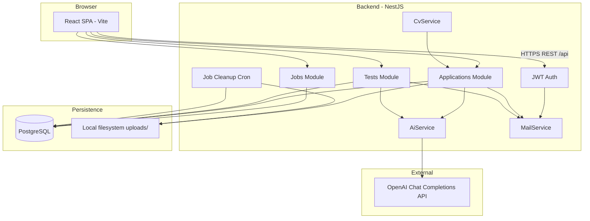
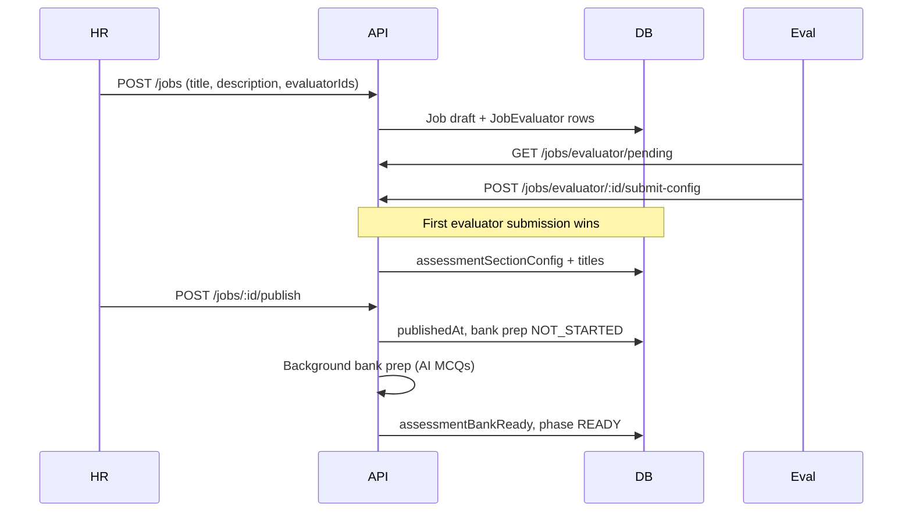
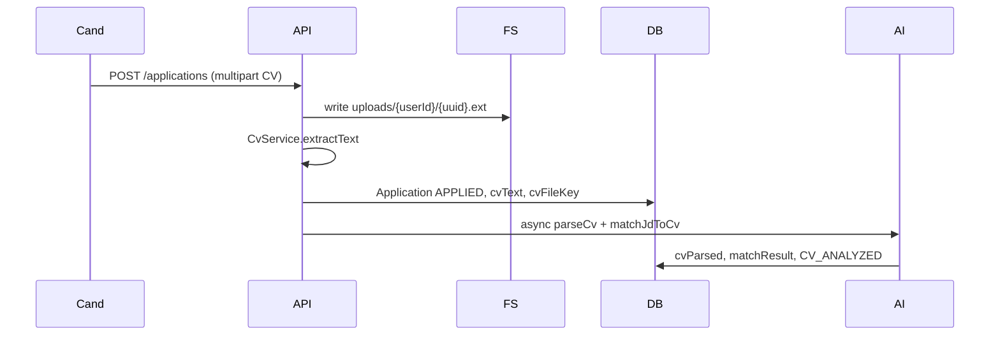

# Recruitment platform — technical design document (TDD)

**Product name (UI):** Futurenostics — Hire Flow  
**Architecture:** Monorepo with separate `frontend/` (SPA) and `backend/` (REST API).  
**Last updated:** May 2026 — reflects current MVP (httpOnly JWT auth, optional transactional email, local CV storage, secured CV API, HR CV/JD retry, evaluator queue search, no AI result summaries).

---

## 1. Purpose

A multi-role hiring platform where:

- **HR** creates jobs, publishes assessments, manages candidates through a pipeline, and makes hiring decisions.
- **Evaluators** design assessment plans (skills + intensity), review graded tests, and leave per-section notes and advisory pass/not-pass recommendations.
- **Candidates** apply with a CV, take a timed multiple-choice test, and see their portal status.

The system uses **OpenAI** for CV parsing, JD–CV matching, and question-bank generation. Tests are **auto-graded** deterministically (no AI grading).

---

## 2. High-level architecture



| Layer | Responsibility |
|-------|----------------|
| **Frontend** | UI, routing, client state, API calls with session cookie |
| **Backend** | Business rules, authorization, file I/O, AI orchestration, grading |
| **PostgreSQL** | Users, jobs, applications, tests, results, question bank, metadata |
| **Local `uploads/`** | Original CV files (PDF/DOCX bytes) |
| **OpenAI** | Structured JSON for CV parse, JD match, MCQ generation |

---

## 3. Technology stack

### 3.1 Frontend (`frontend/`)

| Technology | Version (approx.) | Purpose |
|------------|-------------------|---------|
| **React** | 19 | UI components and pages |
| **TypeScript** | 6 | Type-safe client code |
| **Vite** | 8 | Dev server, HMR, production bundle |
| **React Router** | 7 | Client routing (`createBrowserRouter`, role layouts) |
| **TanStack React Query** | 5 | Server state: fetch, cache, invalidate after mutations |
| **Zustand** | 5 | Auth user in browser (`authStore` + `persist`; JWT not in JS) |
| **Axios** | 1.x | HTTP client with `withCredentials` (httpOnly session cookie) |
| **React Hook Form** | 7 | Login, register, job forms |
| **Zod** | 4 | Form validation (with `@hookform/resolvers`) |
| **Tailwind CSS** | 4 | Utility-first styling (`@tailwindcss/vite`) |

**Key frontend paths**

| Path | Purpose |
|------|---------|
| `src/routes/AppRoutes.tsx` | All routes and role guards |
| `src/routes/lazyPages.tsx` | Code-split route pages |
| `src/api/client.ts` | Axios instance, `VITE_API_URL`, cookie credentials |
| `src/utils/apiError.ts` | API error message helpers |
| `src/features/auth/AuthBootstrap.tsx` | Restores session via `GET /auth/me` |
| `src/features/` | Domain hooks (`jobs`, `applications`, `evaluators`, `assessment`) |
| `src/pages/` | Route-level screens |
| `src/components/` | Shared UI (HR pipeline, assessment panels, CV button) |
| `src/constants/assessmentTaxonomy.ts` | Skill taxonomy for evaluator plan picker (max **10** sections) |
| `src/constants/testIntensity.ts` | `TestIntensityLevel` values + UI labels (keep in sync with backend + Prisma) |

### 3.2 Backend (`backend/`)

| Technology | Purpose |
|------------|---------|
| **NestJS** 10 | Modular HTTP API (`@nestjs/common`, `@nestjs/core`) |
| **Express** (via `@nestjs/platform-express`) | HTTP server |
| **TypeScript** 5 | Server implementation language |
| **Prisma** 5 | ORM, migrations, type-safe DB access |
| **PostgreSQL** | Primary relational database |
| **Passport + JWT** (`@nestjs/jwt`, `passport-jwt`) | JWT in httpOnly cookie (`hire_flow_access_token`); optional `Authorization: Bearer` for tools |
| **cookie-parser** | Read session cookie on API requests |
| **bcrypt** | Password hashing |
| **class-validator / class-transformer** | DTO validation on incoming requests |
| **Multer** (`memoryStorage`) | Parse multipart CV upload in memory before writing to disk |
| **OpenAI Node SDK** | Chat completions with `response_format: json_object` |
| **Zod** (backend) | Validate AI JSON responses (`ai.schemas.ts`) |
| **pdf-parse** | Extract text from PDF CVs |
| **mammoth** | Extract text from DOCX CVs |
| **@nestjs/schedule** + **cron** | Daily job to delete CV files for closed jobs |
| **Jest** | Unit tests (`*.spec.ts`) |

**Nest modules**

| Module | Responsibility |
|--------|----------------|
| `AuthModule` | Register (candidates), login, JWT strategy |
| `UsersModule` | User lookup; HR evaluator CRUD (`/hr/evaluators`) |
| `JobsModule` | Job CRUD, evaluator submit-config, HR publish, bank prep, close job |
| `ApplicationsModule` | Apply, CV storage, AI screening, evaluator assignment, HR decisions |
| `TestsModule` | Test generation, candidate take/submit, grading, HR/evaluator result view |
| `AiModule` | OpenAI prompts and `AiService` (exported) |
| `CvModule` | CV text extraction only |
| `MailModule` | Welcome, test-sent, reject, and interview emails (`mail.service.ts`, `mail.templates.ts`) |
| `PrismaModule` | Shared `PrismaService` |

### 3.3 AI layer (`backend/src/ai/`)

| File | Purpose |
|------|---------|
| `ai.prompts.ts` | System + user prompt strings (CV parse, JD match, MCQ batches) |
| `ai.schemas.ts` | Zod schemas for expected AI JSON shapes |
| `ai.service.ts` | `jsonCompletion()`, `parseCv()`, `matchJdToCv()`, `generateSectionMcqsForTier()` |
| `ai.module.ts` | Nest DI wiring |

**Model:** `OPENAI_MODEL` env (default `gpt-4o-mini`). Requires `OPENAI_API_KEY`; if missing, AI features are skipped or fail gracefully where coded.

### 3.4 What is *not* in the stack (MVP)

- No S3/object storage (CVs on local disk only)
- No Redis / message queue (background AI runs in-process after apply)
- No AI-generated hire/test summaries (removed; grading is rule-based)
- No hire API (`HIRED` status reserved in schema/UI only)

---

## 4. Repository layout

```
AI-Test/
├── frontend/          # React SPA
├── backend/           # NestJS API
│   ├── prisma/        # schema.prisma, migrations/, seed.ts
│   ├── src/           # application source
│   └── uploads/       # CV files (gitignored, created at runtime)
└── docs/
    ├── technical-design.md   # this document
    └── end-to-end-workflow.md # short workflow summary
```

### 4.1 Test intensity (`TestIntensityLevel`)

| Location | Purpose |
|----------|---------|
| `backend/src/common/test-intensity.ts` | Enum values, `isTestIntensityLevel()` for API/grading |
| `frontend/src/constants/testIntensity.ts` | Same values + UI option labels/hints |

**Sync rule:** Prisma enum `TestIntensityLevel` in `schema.prisma` must match `TEST_INTENSITY_LEVELS` in both TS files. Intensity is stored on `Job.assessmentSectionConfig` as JSON strings; the Prisma enum documents allowed values (not a separate DB column per field).

**Tests:** `frontend/src/constants/testIntensity.test.ts` · `backend/src/common/test-intensity.spec.ts`

---

## 5. Roles and authorization

| Role | Enum | Access |
|------|------|--------|
| **Candidate** | `CANDIDATE` | Public jobs, apply, own applications, take assigned test |
| **HR** | `HR` | Own jobs, pipeline, applications, generate/send tests, hiring actions |
| **Evaluator** | `EVALUATOR` | Assigned draft jobs (submit plan), assigned applications under review |

**Auth flow**

1. `POST /api/auth/register` — candidates only; sets httpOnly cookie, returns `{ user }`.
2. `POST /api/auth/login` — any role; sets httpOnly cookie, returns `{ user }`.
3. `POST /api/auth/logout` — clears cookie.
4. `GET /api/auth/me` — current user (cookie or Bearer JWT).

JWT lives in cookie `hire_flow_access_token` (`backend/src/auth/auth-cookie.ts`), not in `localStorage`. Frontend persists **user** only in Zustand; `AuthBootstrap` calls `/auth/me` on load. Dev: Vite proxies `/api` → `localhost:3000` so cookies are same-origin. Routes use `RequireRole` for `/hr/*` and `/eval/*`.

`JwtStrategy.validate()` reloads the user from the database on each request and rejects deactivated accounts (`isActive === false`), even if the JWT has not expired.

**Seed users** (`prisma/seed.ts`): creates local HR and evaluator accounts for development. Run `npm run db:seed`; emails are logged to the console. Do not document or reuse seed credentials in production.

---

## 6. Data model (PostgreSQL)

Prisma schema: `backend/prisma/schema.prisma`.

### 6.1 Core entities

| Model | Purpose |
|-------|---------|
| **User** | Email, password hash, role, name; `isActive` (HR can deactivate evaluators) |
| **Job** | Title, JD, publish/close timestamps, assessment config JSON, bank prep state |
| **JobEvaluator** | HR assigns evaluators to a **draft** job (who may submit the plan) |
| **Application** | Candidate ↔ job; status pipeline; CV fields; AI fields |
| **ApplicationEvaluator** | HR assigns reviewers to an **application**; pass/not-pass advisory |
| **EvaluatorPost** | Per-section evaluator comment (`sectionTitle` + `comment`) |
| **Test** | One attempt per application (typical flow); timer, violations, status |
| **TestSection** | Ordered sections (titles from job plan) |
| **Question** | MCQs on a test; may link to **QuestionBankEntry** |
| **QuestionBankEntry** | Reusable pool per technology/tier |
| **Answer** | Candidate selections per question |
| **Result** | Scores, per-question grades, analytics JSON (no AI summary columns) |

### 6.2 Application status pipeline

```
APPLIED → CV_ANALYZED → TEST_READY → TEST_SENT → TEST_STARTED
  → TEST_SUBMITTED → GRADED → UNDER_REVIEW → INTERVIEW | REJECTED
```

- `HIRED` exists in schema and pipeline UI but **no API sets it yet** (reserved).
- `CV_ANALYZED` set when background AI completes successfully.

### 6.3 Test status

```
DRAFT → SENT → IN_PROGRESS → SUBMITTED | AUTO_SUBMITTED → GRADED
```

- **DRAFT:** HR-generated, not visible to candidate.
- **SENT:** Candidate can open and take the test.

### 6.4 Job assessment configuration

Stored as JSON on `Job`:

- **`assessmentSectionConfig`:** `[{ title, intensity }]` — canonical plan from evaluator.
- **`assessmentSectionTitles`:** string[] — denormalized mirror for queries and fallbacks.

**Intensity** (`TestIntensityLevel`): `INTERN_ASSOCIATE` | `SOFTWARE_ENGINEER` | `SENIOR_DEVELOPER` — drives tier mix for bank fill and per-test draws.

**Section limit:** Up to **10** skill/section titles per plan (enforced in UI and `submit-config` DTO `@ArrayMaxSize(10)`).

**Bank prep** (`AssessmentBankPrepPhase`): `NOT_STARTED` → `FILLING_QUESTIONS` → `READY` | `FAILED`. HR cannot generate candidate tests until `assessmentBankReady === true`.

---

## 7. File storage (CVs)

| What | Where |
|------|--------|
| **Binary file** | `UPLOAD_DIR` (default `backend/uploads/`) on the **server filesystem** |
| **Relative path** | `Application.cvFileKey` e.g. `{candidateUserId}/{uuid}.pdf` |
| **MIME type** | `Application.cvMimeType` |
| **Extracted text** | `Application.cvText` (Postgres `Text`) |
| **AI structured CV** | `Application.cvParsed` (JSON) |
| **JD match** | `Application.matchResult` (JSON) |

**Upload path (apply):** `ApplicationsService` writes file after Multer receives buffer.

**Download path (view CV):** `GET /api/applications/:id/cv` — JWT + role check; streams file (not public static URL). Used by `CvViewButton` on HR application and test result pages.

**Cleanup:** When HR closes a job, cleanup is scheduled; cron (`JobCleanupService`, daily 4am) deletes files and nulls `cvFileKey` / `cvMimeType`.

**Deployment note:** Local disk is fine for single-server dev; production with multiple instances or ephemeral disks needs **shared volume** or **object storage** (not implemented).

---

## 7.1 Email notifications (optional)

When `SMTP_HOST` is set, `MailService` sends HTML + plain-text mail via nodemailer. Sends are **fire-and-forget** (logged on failure; HTTP handlers do not roll back if mail fails). If `SMTP_HOST` is omitted, all mail is skipped.

| Event | When | Template |
|-------|------|----------|
| Welcome | Candidate `POST /auth/register` | Login link |
| Test sent | HR `POST /tests/:id/hr/send` | Job title + applications link |
| Rejected | HR `POST /applications/:id/hr-reject` | Job title |
| Interview | HR `POST /applications/:id/hr-move-to-interview` | Job title + applications link |

**Local dev:** [Mailhog](https://github.com/mailhog/MailHog) on `localhost:1025` (UI http://localhost:8025). **Production:** real SMTP + set `AUTH_COOKIE_SECURE=true` when the API is HTTPS-only.

---

## 8. End-to-end business flow

### Phase A — Job setup (HR + evaluator)



1. **HR** creates job and assigns **job-level** evaluators (`JobEvaluator`).
2. **Evaluator** opens `/eval/jobs/:jobId/configure`, picks skills from taxonomy (`AssessmentTaxonomyPicker`, max **10**), sets **one intensity** for all sections, submits compact payload (`POST .../submit-config` with `{ intensity, sectionTitles[] }`). **First submission wins** for that job.
3. **HR** publishes (`POST /jobs/:id/publish`). Server starts **question bank preparation**: for each section title, fill `QuestionBankEntry` rows (target 50 per skill, tier quotas) using bank draws + OpenAI top-up.
4. Job appears on public job list when `publishedAt` is set and bank becomes ready.

### Phase B — Candidate apply + AI screening



1. **Candidate** registers (welcome email if SMTP configured), logs in, applies on job detail with PDF/DOCX.
2. Server saves file, extracts text, creates application.
3. If `OPENAI_API_KEY` set, background task runs `parseCv` then `matchJdToCv` against job description.
4. **HR** sees JD vs CV match on application page (`CvMatchSummary`); opens file via secured CV endpoint.

### Phase C — Test lifecycle (HR + candidate)

1. **HR** on application page: **Generate test** — builds unique MCQs per section from **question bank** (same topics/intensity as plan, different questions per candidate). Test status `DRAFT`.
2. **HR** **Send to candidate** — `POST /tests/:id/hr/send` → `SENT`; application moves toward `TEST_SENT`; candidate receives test-sent email if SMTP is configured.
3. **Candidate** `/tests/:testId` — timed MCQ (`DEFAULT_QUESTION_SECONDS` = 25s per question), tab-violation counter, autosave answers (`PATCH /tests/:id/answers`), submit (`POST /tests/:id/submit`).
4. Server **grades** deterministically (`grading.ts`, `result-analytics.ts`), writes `Result`, sets test `GRADED`, application `GRADED`.

### Phase D — Evaluator review + HR decision

1. **HR** assigns **application-level** evaluators (`POST /applications/:id/evaluators`).
2. **HR** **Send to evaluators** — application `UNDER_REVIEW`; evaluators see package in portal **evaluation queue** on `/eval`.
3. **Evaluators** search queue by candidate **name or email**, then `/eval/tests/:testId` — section scores, add/edit/delete **EvaluatorPost** notes per `sectionTitle`, submit advisory pass/not-pass (`POST .../evaluator-review`).
4. **HR** rejects (`POST .../hr-reject`) or moves to interview (`POST .../hr-move-to-interview`); candidate receives reject or interview email if SMTP is configured. Evaluator pass flags are **non-binding**.

### Phase E — Job close + retention

1. **HR** closes job (`POST /jobs/:id/close`) — may auto-reject open applications; schedules CV cleanup.
2. Cron deletes CV files from disk and clears keys in DB.

---

## 9. Question bank and test generation

| Constant | Value | Meaning |
|----------|-------|---------|
| `BANK_MAX_PER_SKILL` | 50 | Max MCQs stored per technology/section label |
| `QUESTIONS_REQUIRED_PER_SECTION` | 10 | MCQs per section on each candidate test |
| Tier quotas | 10/15/15/10 | EASY/MEDIUM/HARD/EXPERT distribution in bank |

- **Bank fill:** `QuestionBankService` — uses existing entries + `AiService.generateSectionMcqsForTier` for deficits.
- **Test build:** `TestsService.generateForApplication` — draws from bank per section using intensity tier picks (`test-intensity.util.ts`).
- **Normalization:** `normalizeSectionTitle()` in `jobs/section-title.util.ts` for consistent bank keys.

---

## 10. Grading and results

- **No OpenAI** on submit; scoring compares `selectedOption` to `correctIndex`.
- **Result** stores: `totalScore`, `maxScore`, `sectionScores`, `perQuestion`, `analytics`, `timingStats`, `violationsRecorded`.
- **HR/Evaluator view:** `GET /tests/:id/hr` — sections with questions (including correct answers for review), `result`, application summary; **answers array not exposed** on this payload.
- Frontend: `SectionResultsPanel`, `useApplicationReview` hook for posts + result loading.

---

## 11. API reference (summary)

Base URL: `http://localhost:3000/api` (dev). All JSON unless multipart noted.

### Auth

| Method | Path | Who |
|--------|------|-----|
| POST | `/auth/register` | Public (candidate) |
| POST | `/auth/login` | Public |
| GET | `/auth/me` | JWT |

### Jobs

| Method | Path | Who |
|--------|------|-----|
| GET | `/jobs` | Published open jobs (JWT; typically candidate browse) |
| GET | `/jobs/my/board` | HR board (drafts + totals; `bankPrepInProgress` for polling) |
| GET | `/jobs/my/published?page&limit` | HR paginated published jobs |
| GET | `/jobs/my/published/options` | HR job picker (up to 200 titles) |
| GET | `/jobs/my/closed?page&limit` | HR paginated closed jobs |
| POST | `/jobs` | HR create |
| POST | `/jobs/:id/publish` | HR |
| POST | `/jobs/:id/close` | HR |
| GET | `/jobs/evaluator/pending` | Evaluator |
| POST | `/jobs/evaluator/:id/submit-config` | Evaluator (`intensity` + `sectionTitles`, or legacy `sections[]`) |
| GET | `/jobs/meta/evaluator-users` | HR (active evaluators for assignment) |
| GET | `/hr/evaluators` | HR list evaluators |
| POST | `/hr/evaluators` | HR create evaluator |
| PATCH | `/hr/evaluators/:id` | HR edit name/email/password |
| POST | `/hr/evaluators/:id/deactivate` | HR soft-disable |
| POST | `/hr/evaluators/:id/reactivate` | HR re-enable |

### Applications

| Method | Path | Who |
|--------|------|-----|
| POST | `/applications` | Candidate (multipart) |
| GET | `/applications` | Role-filtered list (evaluator: `UNDER_REVIEW` assigned apps for queue) |
| GET | `/applications/hr/pipeline?jobId=` | HR pipeline for one job |
| GET | `/applications/hr/rejected?page&limit` | HR paginated rejected |
| GET | `/applications/hr/by-job/:jobId` | HR applicants for one job |
| GET | `/applications/:id` | Owner / HR / assigned eval |
| GET | `/applications/:id/cv` | HR / assigned eval (under review) |
| POST | `/applications/:id/tests/generate` | HR |
| POST | `/applications/:id/evaluators` | HR |
| POST | `/applications/:id/send-to-evaluators` | HR |
| POST | `/applications/:id/hr-reject` | HR |
| POST | `/applications/:id/hr-move-to-interview` | HR |
| GET/POST | `/applications/:id/evaluator-posts` | List / create notes |
| PATCH/DELETE | `/evaluator-posts/:postId` | Evaluator own posts |

### Tests

| Method | Path | Who |
|--------|------|-----|
| GET | `/tests/:id/candidate` | Candidate |
| PATCH | `/tests/:id/answers` | Candidate |
| POST | `/tests/:id/submit` | Candidate |
| POST | `/tests/:id/violations` | Candidate |
| POST | `/tests/:id/hr/send` | HR |
| GET | `/tests/:id/hr` | HR / Evaluator |

### Health

| GET | `/health` | Public |

---

## 12. Frontend routes

| Path | Role | Page |
|------|------|------|
| `/` | All | Redirect by role |
| `/login`, `/register` | Guest | Auth |
| `/jobs`, `/jobs/:id` | Candidate | Browse / apply |
| `/applications` | Candidate | My applications |
| `/tests/:testId` | Candidate | Take test |
| `/hr/pipeline` | HR | Pipeline board |
| `/hr/jobs` | HR | Create & manage jobs |
| `/hr/evaluators` | HR | Manage evaluator accounts |
| `/hr/applications/:id` | HR | Application detail |
| `/hr/jobs/:jobId` | HR | Closed job applicants |
| `/hr/tests/:testId` | HR | Test result |
| `/eval` | Evaluator | Portal (draft JDs + evaluation queue with candidate search) |
| `/eval/jobs/:jobId/configure` | Evaluator | Submit assessment plan (taxonomy + intensity) |
| `/eval/tests/:testId` | Evaluator | Review + notes |

---

## 13. Configuration

### Backend (`backend/.env`)

| Variable | Purpose |
|----------|---------|
| `DATABASE_URL` | PostgreSQL connection string |
| `JWT_SECRET` | Sign JWTs |
| `JWT_EXPIRES_DAYS` | Token lifetime (default 7) |
| `PORT` | API port (default 3000) |
| `OPENAI_API_KEY` | Enables AI features |
| `OPENAI_MODEL` | Chat model (default `gpt-4o-mini`) |
| `FRONTEND_URL` | CORS origin + links in email templates |
| `UPLOAD_DIR` | CV storage root (default `./uploads`) |
| `SMTP_HOST` | SMTP server (omit to disable mail) |
| `SMTP_PORT` | SMTP port (default `1025` for Mailhog) |
| `SMTP_SECURE` | `true` for TLS (typical on port 465) |
| `SMTP_USER` / `SMTP_PASS` | Optional SMTP auth |
| `MAIL_FROM` | From header (default `Hire Flow <noreply@hireflow.local>`) |
| `AUTH_COOKIE_SECURE` | Set `true` in production (HTTPS) for httpOnly session cookie |

### Frontend (`frontend/.env`)

| Variable | Purpose |
|----------|---------|
| `VITE_API_URL` | API base (default `/api` — uses Vite dev proxy; set full URL in production, e.g. `https://api.example.com/api`) |

---

## 14. Local development

```bash
# Database
createdb recruitment_mvp   # or use existing Postgres

# Backend
cd backend
cp .env.example .env       # edit DATABASE_URL, JWT_SECRET, OPENAI_API_KEY
npm install
npx prisma migrate deploy
npm run db:seed
npm run start:dev          # http://localhost:3000/api

# Frontend
cd frontend
cp .env.example .env       # optional VITE_API_URL
npm install
npm run dev                # http://localhost:5173
```

**Tests:** `cd frontend && npm test` · `cd backend && npm test`  
**Build:** `cd backend && npm run build` · `cd frontend && npm run build`

---

## 15. Deployment considerations

| Topic | MVP behavior | Production recommendation |
|-------|----------------|---------------------------|
| CV files | Local `UPLOAD_DIR` | S3/R2 + signed URLs |
| Postgres | Required | Managed Postgres |
| OpenAI | API key on server | Secrets manager |
| Single vs multi instance | Works on one VM | Shared storage or object store if scaled |
| Migrations | `prisma migrate deploy` | Run in CI/CD before start |
| Email | Mailhog locally | Production SMTP + `MAIL_FROM` |
| Cookies | `AUTH_COOKIE_SECURE=false` locally | `true` when API is HTTPS |
| Deploy config | None in repo (run backend + frontend on VM/PaaS) | Platform-specific (Vercel/Railway/etc.); CV disk needs persistence or object storage |

---

## 16. Out of scope / future work

- Mark application `HIRED` from UI/API
- Object storage for CVs (S3/R2) instead of local `UPLOAD_DIR`
- Automated sync check for `TestIntensityLevel` across Prisma + backend + frontend (manual discipline today)
- CI/CD pipeline in repo (no `.github/workflows` currently)
- AI-generated result summaries (removed intentionally)
- Public static `/uploads` (removed; secured CV route only)
- HR global candidate search (pipeline per job is the HR view)
- Server-side evaluator queue search API (client-side filter on queue today)
- Apply-confirmation or job-close bulk rejection emails

---

## 17. Related documents

- [End-to-end workflow (short)](./end-to-end-workflow.md) — checklist-style flow for product readers
- [Backend README](../backend/README.md) — quick start commands
